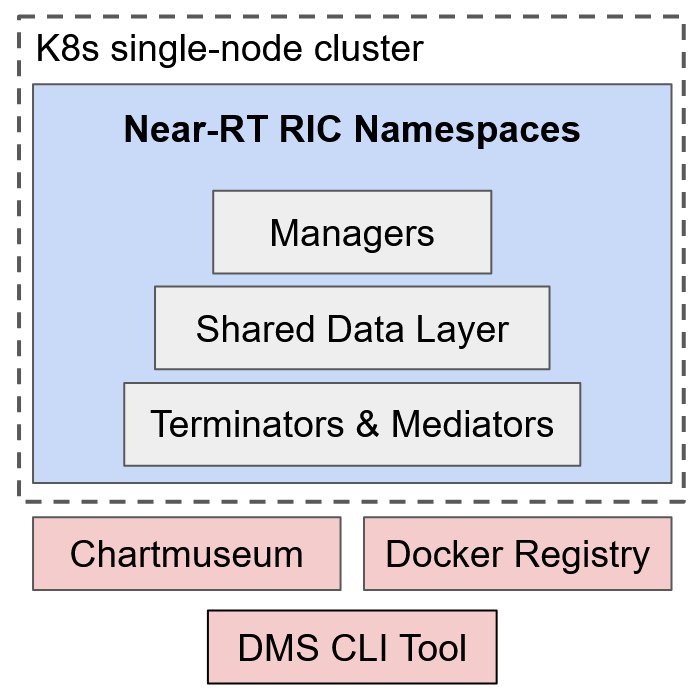
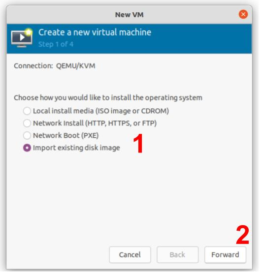
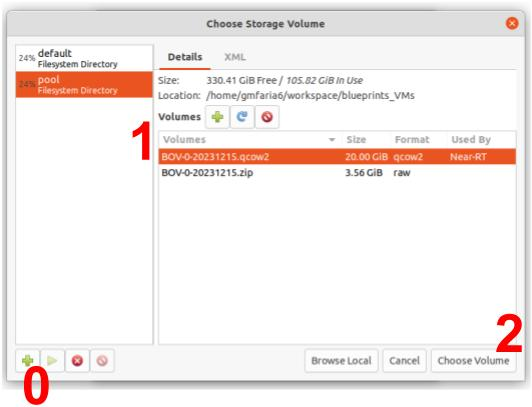
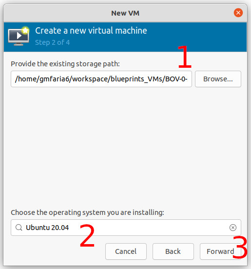

# OpenRAN@Brasil Blueprint v0
The OpenRAN@Brasil Blueprint v0 is a virtual machine image containing an already installed and configured environment for developing and testing xApps on the Near-RT RIC implemented by [Open-RAN Software Community (OSC)](https://o-ran-sc.org/). We provide images for installing the VM using [Virtual Machine Manager](https://virt-manager.org/) and [VirtualBox](https://www.virtualbox.org/). We illustrate Blueprint v0 features below.



**Features**
- OSC's Near-RT RIC platform running as a Kubernetes cluster
- Local Docker Registry container for pushing Docker images
- Local Helm Chart Repository (chartmuseum) container for pushing Helm charts
- OSC's DMS_CLI tool for managing xApps

**Softwares**
- Ubuntu Server 20.04
- Kubernetes v1.16.0 accessible without sudo
- Helm v3.5.4
- Docker  v20.10.21
- OSC's Near-RT RIC Release H
- DMS_CLI (xapp_onboarder) v1.0.0


## Requirements

**Resources**
- RAM: 6GB
- CPU: 2vCPU
- Storage: 20GB

**Packets for LibVirt installation**
- virt-manager 
- qemu-kvm 
- libvirt-daemon-system 
- libvirt-clients 
- bridge-utils

## Deploying VM

### 1st Step - Download the VM Image
Download the [Virtual Machine image](https://drive.google.com/file/d/1yfi_3ZF0s9fDrRXnX73U2WOef0D8573p/view?usp=drive_link) and unzip it.

``` bash
unzip v0_Virt-manager.zip
```

### 2nd Step - Create the virtual machine

Start the `virt-Manager` with sudo privileges.

Select the option `New Virtual Machine` under the `File` menu.

Mark the option `Import existing disk image` before forwarding.



Then, browse and select the downloaded image `v0_original.qcow2`



You may need to add a new `Pool` by clicking in the `+` button marked with 0 in the image above.

Next, set the operating system as `Ubuntu 20.04`, and advance.




In the next screen choose the amount of memory and CPUs for the VM and go forward.

Finally, name your VM and select `Finish`. The VM will be created and initialize.

### 3rd Step - Accessing the virtual machine

In order to access the VM, use the default user.
``` bash
username: openran-br
password: openran-br
```

## Next Steps

Test the deploy of an xApp [(Deploying xApps)](docs/xapp.md).
