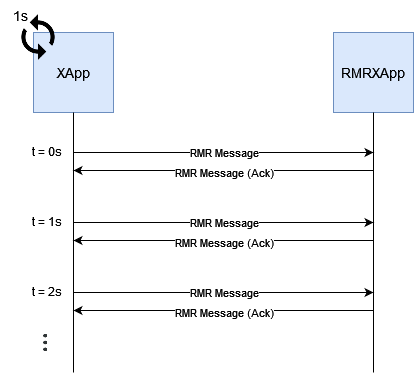

# openran-br-blueprint

## Test
We build and install two xApps that communicate with each other over the RMR library in the Near-RT RIC platform. We use a generic xApp (called XApp) that loops each second sending a message to a reactive xApp (called RMRXApp) that just listens to RMR messages and responds with an ack message. The figure below illustrates this test:



To perform the experiment, clone this repository:
```bash
git clone "https://github.com/LABORA-INF-UFG/openran-br-blueprint"
```

The reactive xApp (RMRXApp) is inside `rmrxapp-test/`, while the generic xApp is in `xapp-test/`. Build and install the RMRXApp executing its script:
```bash
bash openran-br-blueprint/rmrxapp-test/update_xapp.sh
```

Then, do the same with the generic xApp for them to start communicating:
```bash
bash openran-br-blueprint/xapp-test/update_xapp.sh
```
