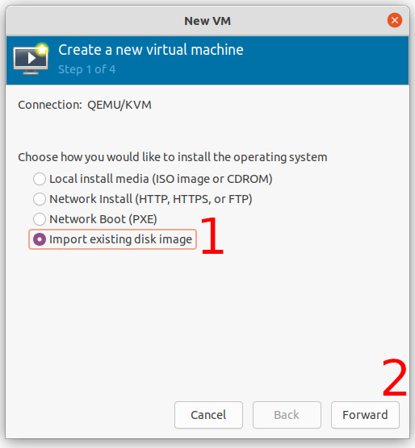
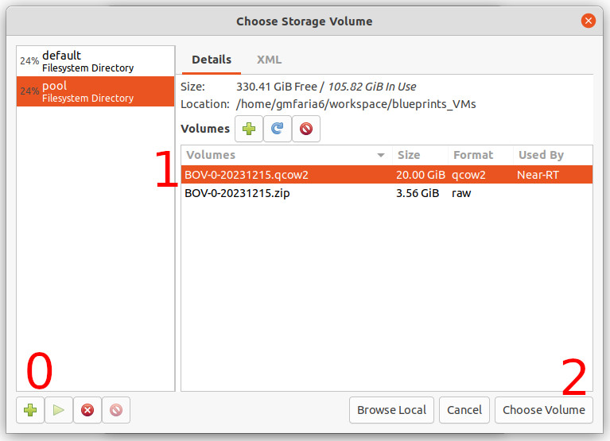
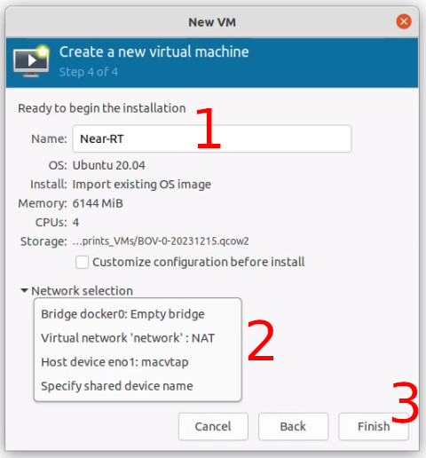

# OpenRAN@Brasil Blueprint v0
The OpenRAN@Brasil Blueprint v0 is a virtual machine image containing an already installed and configured environment for developing and testing xApps on the Near-RT RIC implemented by [Open-RAN Software Community (OSC)](https://o-ran-sc.org/). We provide images for installing the VM using [Virtual Machine Manager](https://virt-manager.org/) and [VirtualBox](https://www.virtualbox.org/). We illustrate Blueprint v0 features below.


**Features**
- OSC's Near-RT RIC platform running as a Kubernetes cluster
- Local Docker Registry container for pushing Docker images
- Local Helm Chart Repository (chartmuseum) container for pushing Helm charts
- OSC's DMS_CLI tool for managing xApps

**Softwares**
- Ubuntu Server 20.04
- Kubernetes v1.16.0 (no sudo)
- Helm v3.5.4
- Docker  v20.10.21 (no sudo)
- OSC's Near-RT RIC Release H
- DMS_CLI v1.0.0 (xapp_onboarder)


## Requirements

**Resources**
- RAM: 6 GB (recommended)
- CPU: 2 vCPU (minimum)
- Storage: 20 GB (recommended)

**Packets for LibVirt installation**
- virt-manager 
- qemu-kvm 
- libvirt-daemon-system 
- libvirt-clients 
- bridge-utils

## Deploying VM

Next, we show how to deploy the virtual machine using the `Virt-Manager GUI`.

But, you can also follow the steps to deploy in the [Virtual Box](docs/virtual-box-deploy.md).

### 1st Step - Download the VM Image
Download the [Virtual Machine image](https://drive.google.com/file/d/1imKhdFbmxiMEOmIIbjUADWkDAYGTh2gI/view?usp=drive_link) and unzip it.

``` bash
unzip BOV-0-20231215.zip
```

### 2nd Step - Open Virtual Machine Manager

Start the `virt-Manager` with sudo privileges.

### 3rd Step - Create the virtual machine

In the `virt-Manager` main window, started with sudo privileges.

Select the option `New Virtual Machine` under the `File` menu.

Mark the option `Import existing disk image` before forwarding.



Then, browse and select the downloaded image `BOV-0-20231215.qcow2`



You may need to add a new `Pool` by clicking in the `+` button marked with 0 in the image above.

Next, set the operating system as `Ubuntu 20.04`, and advance.


In the next screen choose the amount of memory and vCPUs for the VM and go forward.

Now, name your VM and select a virtual network to connect your VM. 

In "Network selection", you can select the virtual network of your choice.



### 4th Step - Accessing the virtual machine

In order to access the VM, use the default user.
``` bash
username: openran-br
password: openran-br
```

Inside the VM terminal, you can get its IP address by executing:
```bash
ip a | grep eth0
```

To access the VM via SSH, you can use its IP address and the default user.
```bash
ssh openran-br@<vm_ip>
```

## VM validation

In order to validate the Near-RT RIC, deploy the test xApps as described in [Deploying xApps](docs/xapp.md).
