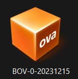
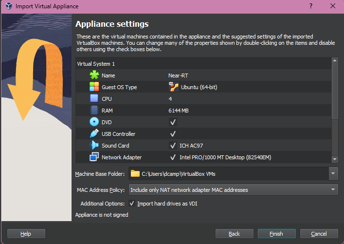
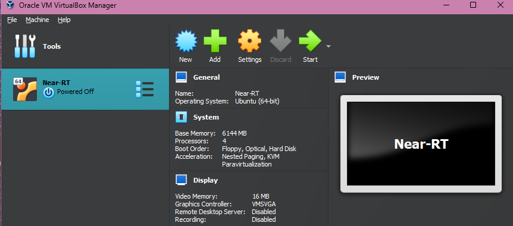

## Deploying VM

### 1st Step - Download the VM Image
Download the [Virtual Box Image](https://drive.google.com/file/d/17vVi04MbaEYw-WCJUPb4mZ3NbQ2I0bik/view?usp=sharing).

### 2nd Step - Create the virtual machine

Double-click the Virtual Box Image downloaded in the 1st Step.



In the opened import window you can change the configuration of the Virtual Machine vCPU and memory resources.



Click `Finish` and wait for the VM to be created.

### 3rd Step - Accessing the virtual machine

Double-click on your VM to start it.



To access the VM, use the default user.
``` bash
username: openran-br
password: openran-br
```

Inside the VM terminal, you can get its IP address by executing:
```bash
ip a | grep eth0
```

To access the VM via SSH, you can use its IP address and the default user.
```bash
ssh openran-br@<vm_ip>
```

## VM validation

To validate the Near-RT RIC, deploy the test xApps as described in [Deploying xApps](docs/xapp.md).
