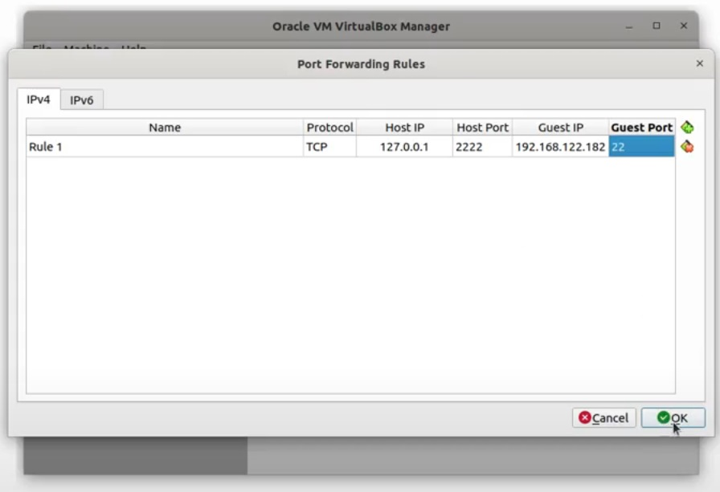
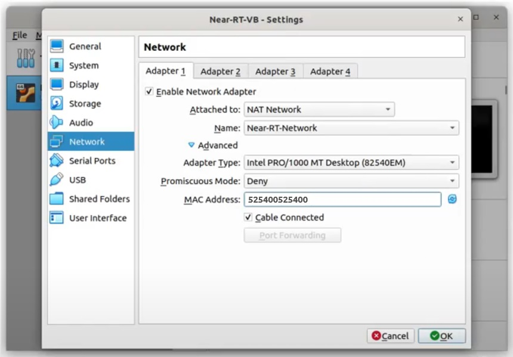

## Deploying VM

### 1st Step - Download the VM Image
Download the [Virtual Box image](https://drive.google.com/file/d/1X1eNDJQCD5gxfRPwFnXYsnrkxNLhmcsS).

### 2nd Step - Create the virtual network

In the `Virtual Box` window, open the `File > Preferences > Network Manager` menu, and click on the `NAT Network` tab.

On the right side, click in the button with a NIC figure and a plus sign to add a new network.

Select the created network by double-clicking it.

Change its name to `Near-RT-Network`, the Network CIDR to `192.168.122.0/24`, and enable the support for `DHCP`.

Select the `Port Forwarding` button.

On the right side of the screen, click in the button with a plus sign to add a new rule to enable SSH.



Now finish the Port Forwarding and Virtual Network configuration, clicking the `OK` button.

### 3rd Step - Create the virtual machine

Double-click the Virtual Box Image downloaded at the 1st Step.

In the opened import window you can inspect the configuration of the Virtual Machine.

Change the `MAC Address Policy` to `Include all network adapter MAC addresses`, and click the button `import`.

After the import process finish, select the created vm with the mouse right button and click `Settings`.

In the `Network` tab, make sure the Network Adapter is enabled and attached to a `NAT Network` with the name `Near-RT-Network`.

Also, in the `Advanced` tab, change the MAC Address to `525400525400`, and finish with `OK` button.



### 4th Step - Accessing the virtual machine

The Virtual Machine is ready to start.

In order to access the VM, use the default user.
``` bash
username: openran-br
password: openran-br
```

You can also access it through SSH with the port forwarded previously.
```bash
ssh openran-br@127.0.0.1 -p 2222
```

## Next Steps

Test the deploy of an xApp [(Deploying xApps)](docs/xapp.md).
