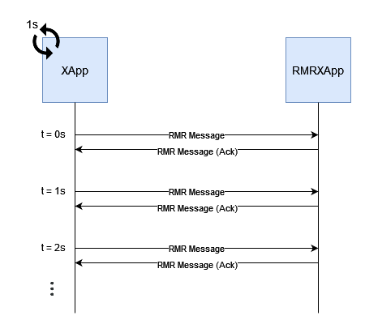

# OpenRAN@Brasil Blueprint

## Deploying xApps

To perform the xApp deployment experiments, clone this repository:
```bash
git clone "https://github.com/LABORA-INF-UFG/openran-br-blueprint"
cd openran-br-blueprint
```

### Single xApp test
We build and install a single xApps that loops logging its running time for each second. As it only logs messages, we call it overhead-xapp, because it can show the minimum resources every xApp developed with OSC's Python xApp framework will spend. To build and install this xApp, simply execute:

```bash
cd xApps/overhead-xapp/
bash update_xapp.sh
cd ../..
```

To watch the xApp logs, execute this script:
```bash
bash xApps/overhead-xapp/watch_xapp.sh
```

### Communication test
We build and install two xApps that communicate with each other over the RMR library in the Near-RT RIC platform. We use a generic xApp (called XApp) that loops each second sending a message to a reactive xApp (called RMRXApp) that just listens to RMR messages and responds with an ack message. The figure below illustrates this test:



The reactive xApp (RMRXApp) is inside [reactive-xapp/](../xApps/rmrxapp-test), while the generic xApp is in [active-xapp/](../xApps/xapp-test/). You must deploy the reactive xApp **before** the active xApp. Build and install the RMRXApp executing its script:
```bash
cd xApps/reactive-xapp/
bash update_xapp.sh
cd ../..
```

To watch the xApp logs, execute this script:
```bash
bash xApps/reactive-xapp/watch_xapp.sh
```

Then, do the same with the generic xApp for them to start communicating:
```bash
cd xApps/active-xapp/
bash update_xapp.sh
cd ../..
```

To watch the xApp logs, execute this script:
```bash
bash xApps/active-xapp/watch_xapp.sh
```